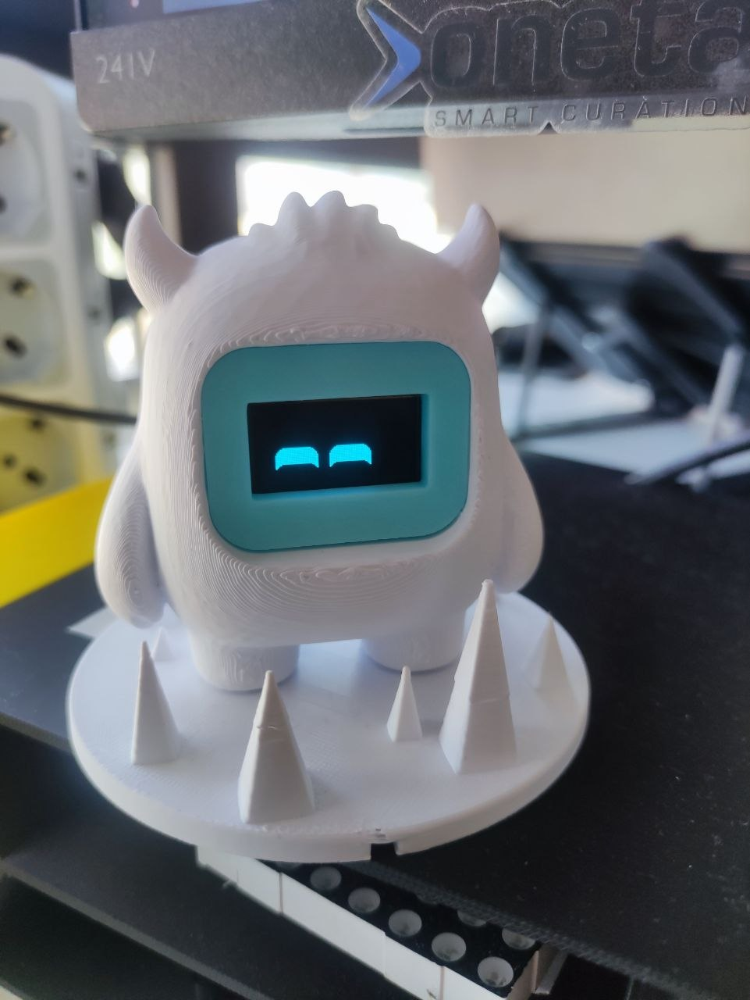
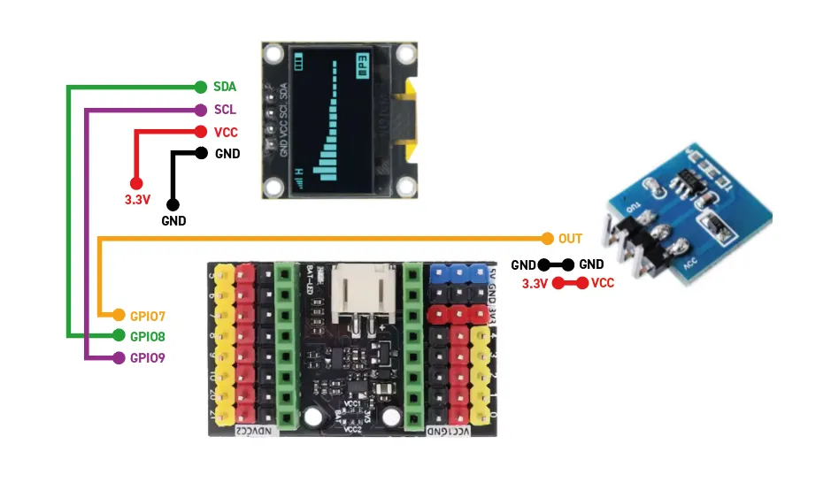
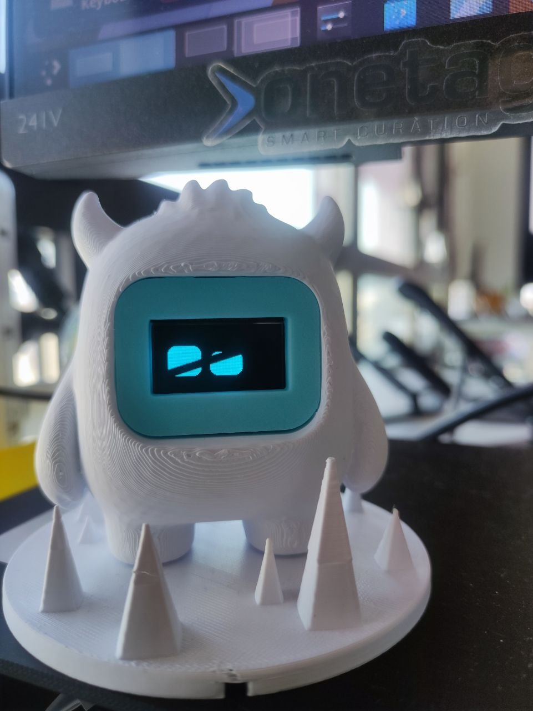
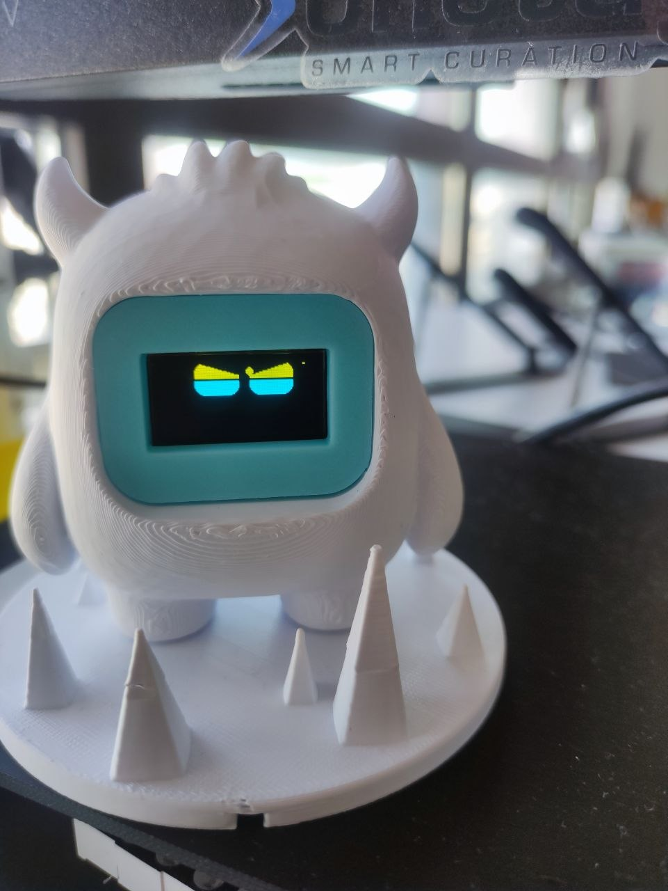
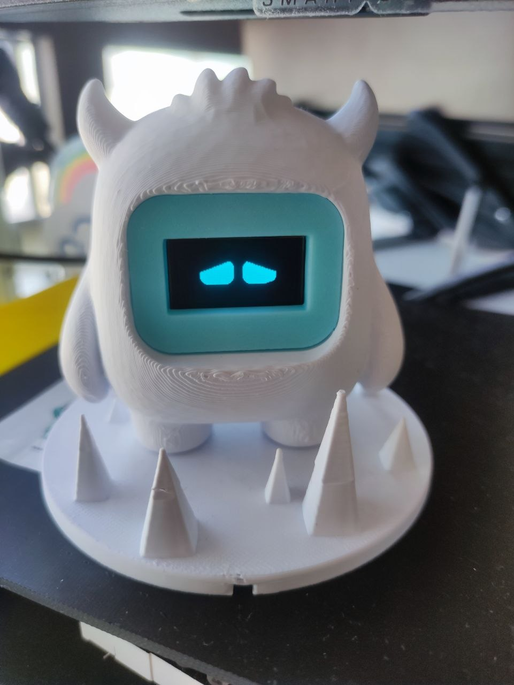
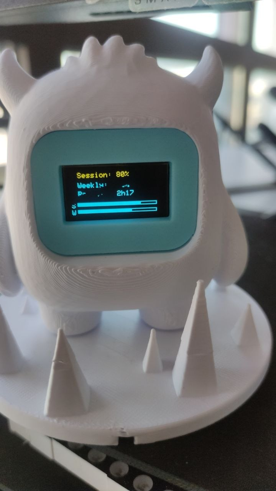

# Claude Usage Monitor

A physical desk gadget that shows how much of your Claude usage you've burned through. An ESP32-C3 with a tiny OLED displays an animated robot face whose mood reflects your current usage — happy when you have tokens to spare, angry when you're running low. Press the button for live stats or a (deliberately rude) motivational phrase.

<p align="center">
  
</p>

The electronics live inside a 3D-printed **Compagnon** robot (see [Credits](#credits)).

It has two parts:

1. **`server.js`** — a Node.js proxy that runs on your computer. It reads your `claude.ai` session cookie straight out of your local Chrome/Chromium cookie store, calls the private claude.ai usage API, and re-exposes a clean JSON summary over plain HTTP on your LAN.
2. **The ESP32 firmware** (`claude_usage_roboeyes/claude_usage_roboeyes.ino`) — polls the proxy every 5 minutes and renders the result on a 128×64 SSD1306 OLED.

```
┌───────────────┐      reads cookies       ┌──────────────┐    HTTPS    ┌────────────┐
│ Chrome/Chromium│◀────────────────────────│  server.js   │────────────▶│ claude.ai  │
│  (logged in)   │                          │  (your PC)   │   /usage    │  usage API │
└───────────────┘                          └──────┬───────┘             └────────────┘
                                                   │ HTTP  GET /usage  (LAN)
                                                   ▼
                                            ┌──────────────┐
                                            │   ESP32-C3   │
                                            │  + OLED + btn│
                                            └──────────────┘
```

---

## Why a proxy?

The claude.ai usage endpoint sits behind Cloudflare and authenticates via a browser `sessionKey` cookie — there's no token-based API for it. An ESP32 can't reproduce a browser's TLS fingerprint or hold a logged-in session, so the proxy does the hard part on a real machine:

- It pulls `sessionKey` and `__cf_clearance` out of the local Chrome cookie database (decrypting them where necessary).
- It fetches the usage endpoint with **`curl`** — curl's TLS fingerprint passes Cloudflare where Node's `https` module gets a 403 challenge.
- It returns a small, stable JSON payload the microcontroller can parse with minimal RAM.

---

## Part 1 — The proxy server

### Requirements

- **Node.js** 18+
- **`curl`** on `PATH` (used for the actual usage request)
- **Chrome or Chromium**, logged in to claude.ai, ideally left running
- Linux desktop. Cookie auto-reading is implemented for Linux Chrome/Chromium only (see [Cookie reading](#cookie-reading)). On other platforms use the [environment-variable fallback](#manual-cookie-fallback).

### Install & run

```bash
npm install
npm start          # node server.js
# or, with auto-reload during development:
npm run dev        # node --watch server.js
```

On start you'll see:

```
✅  Claude usage proxy  http://0.0.0.0:3456
   Org      : 1d446918-...
   Endpoint : http://<your-pc-ip>:3456/usage
```

Test it:

```bash
curl http://localhost:3456/usage
```

### Mock mode (testing the faces)

To cycle the ESP32 through every face without spending real usage, run the proxy with a mocked `/usage` response:

```bash
npm run happy      # worst_pct 25  → HAPPY face
npm run neutral    # worst_pct 55  → DEFAULT (wide eyes)
npm run sad        # worst_pct 80  → ANGRY + sweat
npm run angry      # worst_pct 95  → ANGRY + sweat (server mood "angry")
npm run tired      # /usage returns HTTP 500 → TIRED (fetch-failed) face
```

Under the hood these set the `MOCK` env var, which short-circuits the cookie/curl path entirely. You can also pass an exact percentage:

```bash
MOCK=42 npm start          # worst_pct ≈ 42
MOCK=happy node server.js  # same as npm run happy
```

Mocked responses include `"mock": true` so you can tell them apart. Leave `MOCK` unset for normal (live) operation.

### Configuration

Most settings are constants at the top of [server.js](server.js):

| Constant      | Default | Meaning |
|---------------|---------|---------|
| `PORT`        | `3456`  | HTTP port the proxy listens on (binds `0.0.0.0`) |
| `ORG_ID`      | hard-coded | Your claude.ai organization UUID — **must match your account** |
| `CACHE_TTL_MS`| `60_000` | How long a usage response is cached before re-fetching |
| `COOKIE_TTL_MS`| `240_000` | How often the Chrome cookie DB is re-read |

> **Finding your `ORG_ID`:** open claude.ai in your browser, open DevTools → Network, and look for a request to `/api/organizations/<UUID>/usage`. Copy that UUID into `server.js`.

### The `/usage` response

```jsonc
{
  "session_pct":           42,            // 5-hour window utilization, %
  "session_reset_minutes": 137,           // minutes until 5-hour window resets
  "session_resets_at":     "2026-06-18T15:00:00Z",
  "weekly_pct":            68,             // 7-day window utilization, %
  "weekly_resets_at":      "2026-06-22T00:00:00Z",
  "weekly_reset_minutes":  5400,
  "worst_pct":             68,             // max(session, weekly) — drives the face
  "mood":                  "neutral",      // happy | neutral | sad | angry
  "timestamp":             "2026-06-18T12:43:00Z"
}
```

`worst_pct` is the headline number the firmware uses to pick a mood. `mood` is derived server-side as: `happy` < 40 ≤ `neutral` < 70 ≤ `sad` < 90 ≤ `angry`.

### Cookie reading

On Linux, the proxy locates the Chrome/Chromium cookie SQLite DB from a list of known paths (snap Chromium profiles, native `~/.config/google-chrome`, `~/.config/chromium`). Cookies for `claude.ai` are read directly; encrypted values (`v10`/`v11`) are decrypted with AES-128-CBC using a key derived via `PBKDF2(password, "saltysalt", 1, 16, sha1)`. The decryption password is looked up, in order, from:

1. KWallet (`kwallet-query`, KDE)
2. GNOME keyring (`secret-tool`)
3. The fallback literals `"peanuts"` and `""` (used by Chrome when no keyring is present)

If the DB is locked (Chrome running with WAL), it's opened read-only; if that fails, the DB + WAL/SHM files are copied to a temp location and read from there.

> Requires the optional **`better-sqlite3`** dependency. It's listed in `package.json`, so `npm install` pulls it in. If it's missing, the proxy still runs but can only use the env-var fallback below.

### Manual cookie fallback

If automatic reading doesn't work (non-Linux, no keyring, Chrome closed), supply the cookies by hand:

```bash
export SESSION_KEY="sk-ant-sid01-..."     # the sessionKey cookie value
export CF_CLEARANCE="..."                 # the __cf_clearance cookie value
npm start
```

These override whatever was read from the cookie store.

### Troubleshooting

| Symptom | Likely cause / fix |
|---------|--------------------|
| `Cloudflare blocked (403)` | Chromium not open or not signed in. Open claude.ai in the browser; the proxy invalidates its cookie cache and retries on the next request. |
| `Usage API HTTP 401/403` | Stale/missing `sessionKey`. Re-log in to claude.ai, or set `SESSION_KEY` manually. |
| `[cookies] better-sqlite3 not installed` | Run `npm install`, or use the env-var fallback. |
| `cf_clearance:✗  sessionKey:✗` in logs | No cookies found — wrong profile path, locked DB, or wrong keyring password. |
| Empty / wrong numbers | Wrong `ORG_ID` for your account. |

---

## Part 2 — The ESP32 firmware

The sketch [claude_usage_roboeyes/claude_usage_roboeyes.ino](claude_usage_roboeyes/claude_usage_roboeyes.ino) reads the `/usage` endpoint and renders it with animated [FluxGarage RoboEyes](https://github.com/FluxGarage/RoboEyes) — auto-blinking, idle glances, sweat drops.

### Hardware

| Component | Connection |
|-----------|-----------|
| SSD1306 128×64 OLED (I²C) | `SDA → GPIO8`, `SCL → GPIO9`, `VCC → 3.3 V`, `GND → GND` |
| Push button               | `GPIO7` ↔ GND (uses `INPUT_PULLUP`, active LOW) |
| Board                     | ESP32-C3 ("ESP32C3 Dev Module") |

<p align="center">
  
</p>

### Libraries (Arduino Library Manager)

- Adafruit SSD1306
- Adafruit GFX Library
- ArduinoJson (≥ v7)
- **FluxGarage RoboEyes** — *RoboEyes sketch only*
- HTTPClient — built-in with the ESP32 core

### Flashing

1. Install the **esp32** board package (Espressif, ≥ 3.x) and select **ESP32C3 Dev Module**.
2. Edit the config block at the top of the sketch:
   ```cpp
   const char* WIFI_SSID     = "your-wifi";
   const char* WIFI_PASSWORD = "your-password";
   const char* SERVER_IP     = "192.168.1.156";  // the PC running server.js
   const int   SERVER_PORT   = 3456;
   ```
3. Make sure `SERVER_IP` is the LAN IP of the machine running the proxy.
4. Upload.

### Behaviour

**Faces by `worst_pct`:**

| Usage | RoboEyes mood |
|-------|---------------|
| 0–39 % | `HAPPY` |
| 40–69 % | `DEFAULT` (wide) |
| 70–100 % | `ANGRY` + sweat |
| fetch failed | `TIRED` (half-closed) |

<table align="center">
  <tr>
    <td align="center"><br><sub><b>HAPPY</b> · 0–39 %</sub></td>
    <td align="center"><br><sub><b>DEFAULT</b> · 40–69 %</sub></td>
  </tr>
  <tr>
    <td align="center"><br><sub><b>ANGRY</b> · 70–100 %</sub></td>
    <td align="center"><br><sub><b>TIRED</b> · fetch failed</sub></td>
  </tr>
</table>

These are easy to cycle through with the proxy's [mock mode](#mock-mode-testing-the-faces) (`npm run happy|neutral|sad|angry|tired`).

**Button:**

- **Short press** — cycle face ↔ live stats screen (session %, weekly %, reset countdown, bar graphs).
- **Long press (2 s)** — show a random snarky phrase with a typewriter animation, picked from a tier matching current usage. Auto-dismisses after ~3 s.

<p align="center">
  <br>
  <sub>The stats screen (short press)</sub>
</p>

The firmware polls every 5 minutes (`POLL_INTERVAL_MS`). Tunable timing constants (blink cadence, typewriter speed, long-press threshold) live in the config block.

> **Note on the RoboEyes sketch:** RoboEyes owns the display buffer while the face is showing. The manually-drawn screens (stats, phrase, splash) must only be drawn when *not* in `VIEW_FACE`, otherwise the two fight over the buffer. The view state machine in `loop()` enforces this.

---

## Security note

`server.js` reads your browser's claude.ai session cookie and serves usage data **unauthenticated over plain HTTP**. Keep it on a trusted LAN — anyone who can reach `http://<your-pc>:3456/usage` sees your usage numbers (not your cookies, but still). Don't port-forward it to the internet. The Wi-Fi credentials and org ID currently committed in the sketches are placeholders/personal — replace them with your own and avoid committing real secrets.

---

## Repository layout

```
.
├── server.js                              # Node proxy: cookies → claude.ai → /usage JSON
├── package.json                           # express + better-sqlite3
├── claude_usage_roboeyes/
│   └── claude_usage_roboeyes.ino          # ESP32 firmware — RoboEyes edition
└── images/                                # photos + wiring diagram used in this README
```

---

## Credits

- **3D model — "Compagnon #309 · Build your expressive robot"** by the original creator on MakerWorld. The printed enclosure (the horned yeti body, the face bezel, and the spiked base) all come from this model:
  <https://makerworld.com/en/models/2109424-compagnon-309-build-your-expressive-robot#profileId-2281938>
- **[FluxGarage RoboEyes](https://github.com/FluxGarage/RoboEyes)** — the animated-eyes library powering the firmware.
